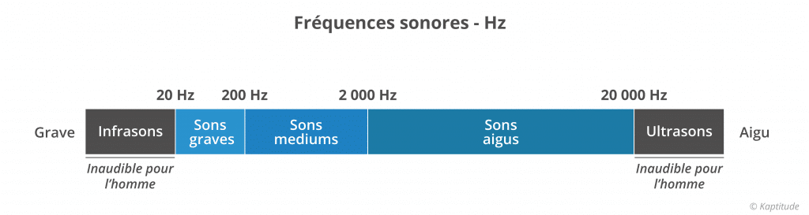
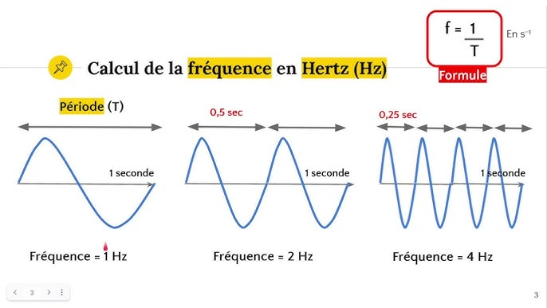
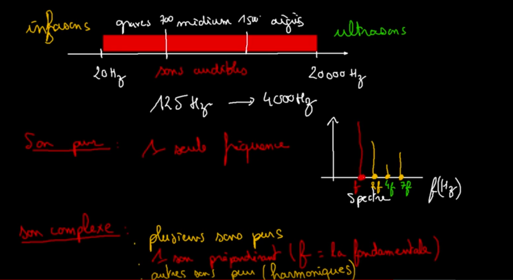
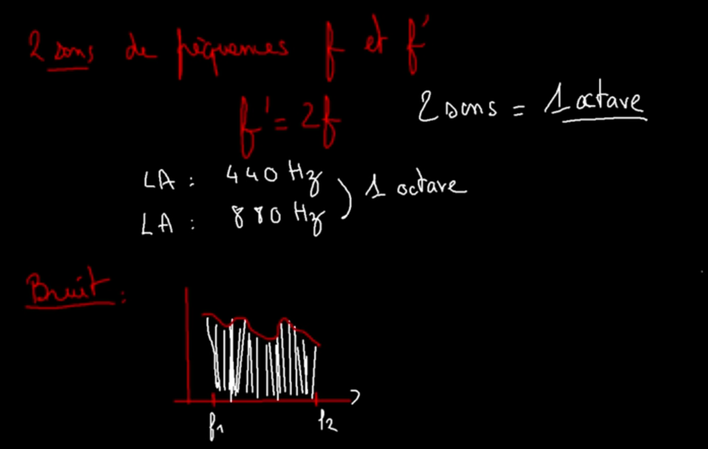

<link rel="stylesheet" href="style.css"/>

# Les ondes sonores

 

la perception du son est un changement de pression (pression atmospherique + pression accoustique)

$$
pression(bar) = \frac{force}{unitede surface}
$$

 
frequence = nombre d'oscillation de la pression accoustique en 1sec.
 
 

    
    <table>
    <tr>
        <th>frequence</th>
        <th>periode</th>
        <th>sonorite</th>
    </tr>
    <tr>
        <td>haute</td>
        <td>courte</td>
        <td>aigu</td>
    </tr>
    <tr>
        <td>basse</td>
        <td>longue</td>
        <td>grave</td>
    </tr>
    </table>

 

---------------------------------

 

    
    

## Sinusoidales

ω (omega) = pulsation 
φ (phi) = phase a l'origine en radian 
t = temps (periode) 
A = amplitude 
f = frequence en hz

$$
t = \frac{2π}{ω}
$$
$$
f = \frac{1}{t}
$$
$$
s(t)= A*cos(2πft+φ)
$$
$$
==
$$
$$
s(t) =A* cos(ωt+φ)
$$

 

# Conversion Analogique &#8594; digitale 

frequence = cycles par seconde (hz)
sample rate = samples par seconde (hz)

samping rate doit etre au moins 2 fois plus grande que l'amplitude max du signal (Nyquist-Shannon theoreme)

basique sampling rate  = 44100 hz