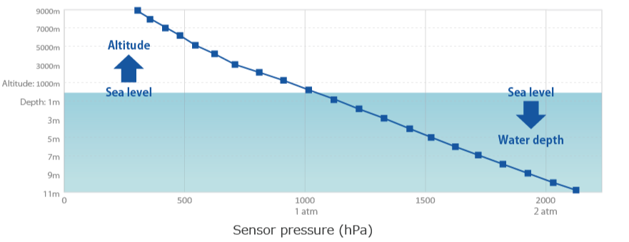

<link rel="stylesheet" href="style.css"/>

# CAPTEUR DE PRESSION

 

**pression = profondeur du drone (1000 hpa = 1 bar)**

Pourquoi les capteurs de pression fonctionnent-ils si bien pour récupérer les informations de profondeur ?  
Comme la densité de l'eau est constante dans la plupart des environnements, tout comme la gravité, la pression sous-marine est directement proportionnelle à la profondeur de submersion

# CENTRALE A INERTIE

https://www.gotron.be/mpu6050-sensor-3-axis-accelerometer-gyroscope.html

Une centrale à inertie ou centrale inertielle est un instrument utilisé en navigation, capable d'intégrer les mouvements d'un mobile pour estimer son orientation, sa vitesse linéaire et sa position. L'estimation de position est relative au point de départ ou au dernier point de recalage

